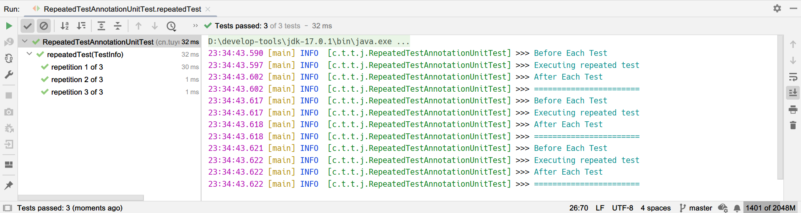
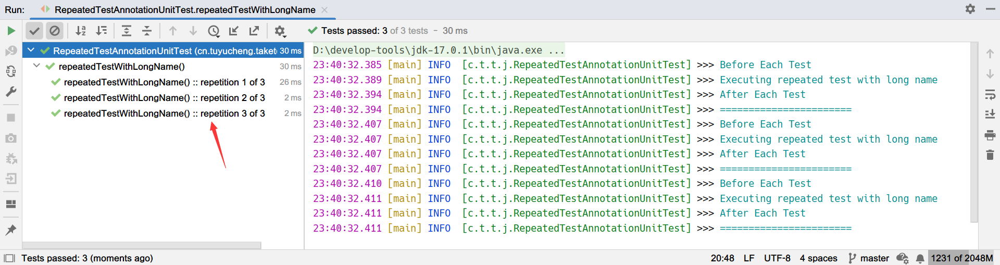
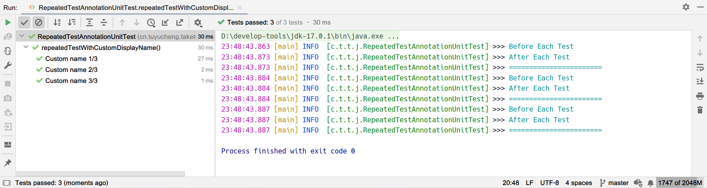
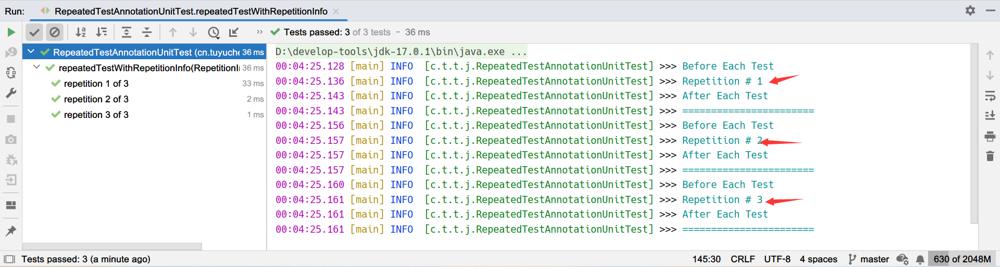

## 1. 概述

在这篇文章中，我们将看看JUnit 5中引入的@RepeatedTest注解。它为我们提供了一种强大的功能来编写我们想要重复多次运行的任何测试。

如果你想了解有关JUnit 5的更多信息，可以参考其他的文章。

## 2. maven依赖

首先要注意的是，JUnit 5最低需要Java 8才能运行。

```
<dependency>
    <groupId>org.junit.jupiter</groupId>
    <artifactId>junit-jupiter-engine</artifactId>
    <version>5.8.1</version>
    <scope>test</scope>
</dependency>
```

这是我们编写Junit 5测试时需要添加的主要依赖项。

## 3. @RepeatedTest例子

创建可重复执行的测试很简单 - 只需在测试方法上添加@RepeatedTest注解：

```java
class RepeatedTestAnnotationUnitTest {
    private static final Logger LOGGER = LoggerFactory.getLogger(RepeatedTestAnnotationUnitTest.class);

    @RepeatedTest(3)
    void repeatedTest(TestInfo testInfo) {
        LOGGER.info("Executing repeated test");
        assertEquals(2, Math.addExact(1, 1), "1 + 1 should equal 2");
    }
}
```

注意，我们使用@RepeatedTest标注单元测试方法，而不是标准的@Test注解。上述测试方法将被执行3次，就好像同一个测试被写了3次一样。

我们可以在IDEA中的run窗口看到所有的执行报告：



## 4. @RepeatedTest的生命周期支持

**@RepeatedTest的每次执行与常规的@Test一样，支持标准的测试生命周期**。
这意味着，在每次执行期间，都会调用@BeforeEach和@AfterEach方法。为了证明这一点，我们在测试类中加上对应的生命周期方法：

```java
class RepeatedTestAnnotationUnitTest {

    @BeforeEach
    void beforeEachTest() {
        LOGGER.info("Before Each Test");
    }

    @AfterEach
    void afterEachTest() {
        LOGGER.info("After Each Test");
        LOGGER.info("=======================");
    }
}
```

如果我们运行之前的测试，控制台打印的日志如下所示：

```
23:38:17.154 [main] INFO  [c.t.t.j.RepeatedTestAnnotationUnitTest] >>> Before Each Test 
23:38:17.161 [main] INFO  [c.t.t.j.RepeatedTestAnnotationUnitTest] >>> Executing repeated test 
23:38:17.167 [main] INFO  [c.t.t.j.RepeatedTestAnnotationUnitTest] >>> After Each Test 
23:38:17.167 [main] INFO  [c.t.t.j.RepeatedTestAnnotationUnitTest] >>> ======================= 
23:38:17.180 [main] INFO  [c.t.t.j.RepeatedTestAnnotationUnitTest] >>> Before Each Test 
23:38:17.181 [main] INFO  [c.t.t.j.RepeatedTestAnnotationUnitTest] >>> Executing repeated test 
23:38:17.182 [main] INFO  [c.t.t.j.RepeatedTestAnnotationUnitTest] >>> After Each Test 
23:38:17.182 [main] INFO  [c.t.t.j.RepeatedTestAnnotationUnitTest] >>> ======================= 
23:38:17.185 [main] INFO  [c.t.t.j.RepeatedTestAnnotationUnitTest] >>> Before Each Test 
23:38:17.185 [main] INFO  [c.t.t.j.RepeatedTestAnnotationUnitTest] >>> Executing repeated test 
23:38:17.185 [main] INFO  [c.t.t.j.RepeatedTestAnnotationUnitTest] >>> After Each Test 
23:38:17.185 [main] INFO  [c.t.t.j.RepeatedTestAnnotationUnitTest] >>> ======================= 
```

**我们可以看到，在每次执行时都会调用@BeforeEach和@AfterEach方法**。

## 5. 配置测试名

在第一个例子中，我们观察到测试报告的输出不包含任何标识符。可以使用@RepeatedTes注解的”name“属性进行配置：

```java
class RepeatedTestAnnotationUnitTest {

    @RepeatedTest(value = 3, name = RepeatedTest.LONG_DISPLAY_NAME)
    void repeatedTestWithLongName() {
        LOGGER.info("Executing repeated test with long name");
        assertEquals(2, Math.addExact(1, 1), "1 + 1 should equal 2");
    }
}
```

现在，显示名称将包含方法名称和索引：



另一种方式是使用RepeatedTest.SHORT_DISPLAY_NAME，生成的测试名使用短名称：

```
repetition 1 of 3
repetition 2 of 3
repetition 3 of 3
```

我们也可以使用我们自定义的名称：

```java
class RepeatedTestAnnotationUnitTest {

    @RepeatedTest(value = 3, name = "Custom name {currentRepetition}/{totalRepetitions}")
    void repeatedTestWithCustomDisplayName() {
        assertEquals(2, Math.addExact(1, 1), "1 + 1 should equal 2");
    }
}
```

**{CurrentRepeation}和{TotalRepeations}是当前测试和测试总数的占位符。这些值由JUnit在运行时自动提供，不需要额外的配置**。
运行结果如下所示：



## 6. RepetitionInfo

除了name属性外，JUnit还提供了对重复测试中元数据的访问。这是通过在我们的测试方法中添加RepetitionInfo参数来实现的：

```java
class RepeatedTestAnnotationUnitTest {

    @RepeatedTest(3)
    void repeatedTestWithRepetitionInfo(RepetitionInfo repetitionInfo) {
        LOGGER.info("Repetition # {}", repetitionInfo.getCurrentRepetition());
        assertEquals(3, repetitionInfo.getTotalRepetitions());
    }
}
```

输出将包含每个执行的当前测试的索引：



RepetitionInfo示例由RepetitionInfoParameterResolver提供并且自动注入到我们的测试方法参数，仅在@RepeatedTest的上下文中可用。

## 7. 总结

在这个教程中，我们详细介绍了JUnit提供的@RepeatedTest注解并演示了不同的配置方法。